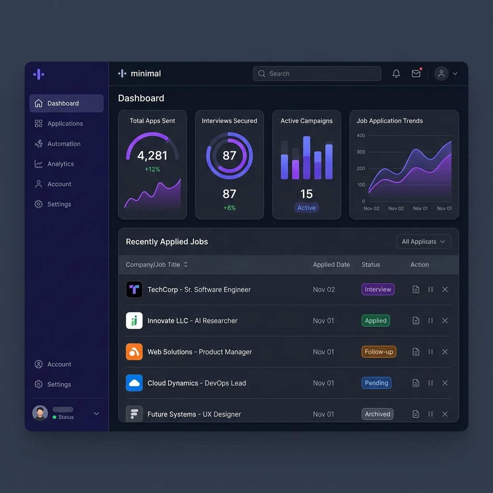
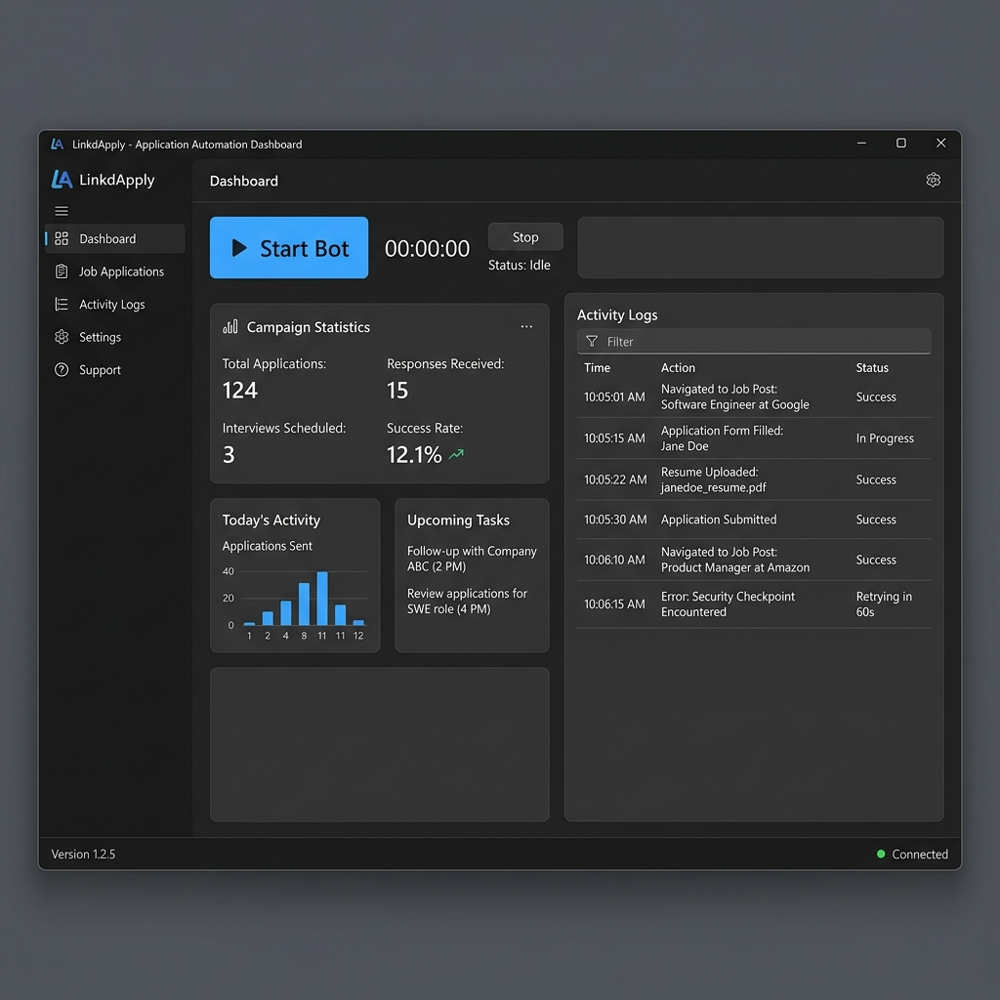

# 🚀 LinkedIn AI Auto Job Applier

[](https://github.com/yhimanshu22/Auto_job_applier_linkedIn/stargazers)

**Automate your job search with the power of AI.** This tool handles the tedious parts of job hunting—searching for relevant roles, answering complex application questions, and submitting applications—so you can focus on preparing for interviews.

---

## ✨ Key Features

- 🤖 **AI-Driven Applications**: Uses OpenAI, DeepSeek, or Gemini to intelligently answer application-specific questions based on your profile.
- ⚡ **Lightning Fast Search**: Automatically filters and identifies jobs that match your skills and preferences.
- 🖥️ **Premium Desktop Dashboard**: A sleek, modern UI built with Next.js and Electron to manage your settings, view real-time logs, and track performance.
- 🛡️ **Anti-Detection System**: Features "Safe Mode" and human-like interaction patterns to keep your LinkedIn account secure.
- 💳 **Seamless Subscriptions**: Integrated with Stripe and Razorpay for premium features.
- 📂 **Resume Management**: Automatically handles multiple resumes and dynamically selects the best one for each role.

---

## 📸 Screenshots

| Dashboard Overview | Desktop App |
|:---:|:---:|
|  |  |

---

## 🛠️ Tech Stack

- **Frontend**: Next.js 15, React 19, Tailwind CSS
- **Backend**: FastAPI (Python), Selenium, Playwright
- **Desktop**: Electron Wrapper
- **AI Integration**: OpenAI, DeepSeek, Google Gemini, Anthropic Claude
- **Database**: SQLite
- **Payments**: Stripe & Razorpay

---

## 🚀 Quick Start

### 1. Prerequisites
- Python 3.10+
- Node.js & npm/pnpm
- Google Chrome

### 2. Installation
```bash
# Clone the repository
git clone https://github.com/yhimanshu22/Auto_job_applier_linkedIn.git

# Install Backend dependencies
cd backend
pip install uv
uv sync

# Install Frontend dependencies
cd ../frontend
npm install
```

### 3. Run the App
```bash
# Start all services (Dashboard + Backend + Electron)
./start_servers.bat
```

---

## ❤️ Support & Sponsorship

Building and maintaining an AI-powered automation tool requires significant resources and continuous updates to keep up with LinkedIn's platform changes. If this tool has helped you land a job or saved you time, please consider sponsoring the project!

### 🌟 Why Sponsor?
- **Faster Feature Development**: Your support allows me to dedicate more time to implementing new AI models and features.
- **Maintenance**: Helps cover the costs of testing and updating the bot to remain undetectable.
- **Priority Support**: Sponsors get priority response to issues and feature requests.

### 💰 Donation Links
- [**GitHub Sponsors**](https://github.com/sponsors/yhimanshu22) - *Preferred*
- [**Buy Me a Coffee**](https://www.buymeacoffee.com/yhimanshu22)
- [**PayPal**](https://paypal.me/yhimanshu22)
- [**Razorpay (UPI/INR)**](https://rzp.io/l/your-link)

---

## 🗺️ Roadmap

- [ ] Support for more job boards (Indeed, Glassdoor).
- [ ] Advanced AI personalization based on job descriptions.
- [ ] Real-time browser view within the dashboard.
- [ ] Mobile companion app for tracking.

---

<p align="center">Made with ❤️ by <a href="https://github.com/yhimanshu22">Himanshu</a></p>
